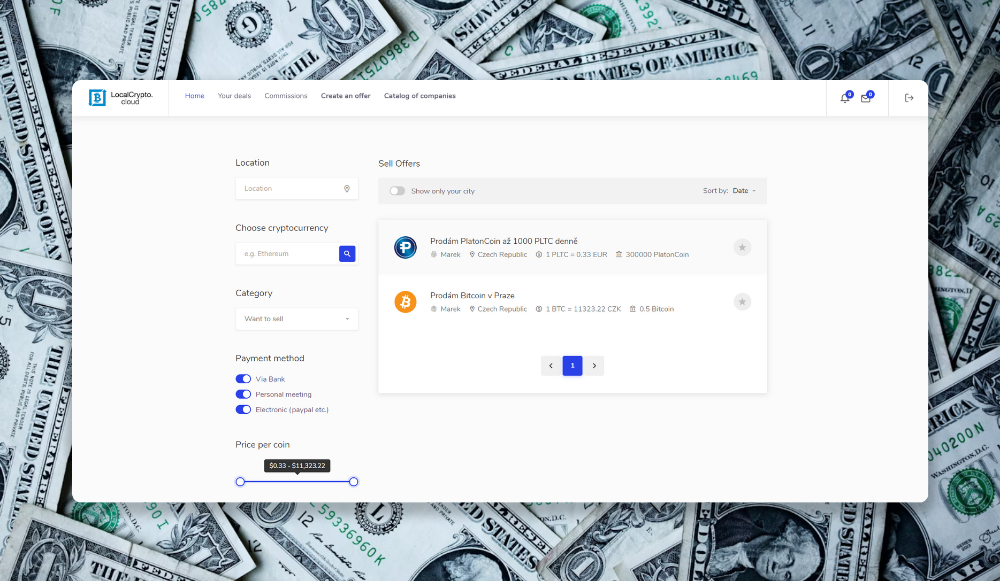

# Localcrypto by swenlii

💶 сайт для обмена и покупки криптовалюты

 

> ⚠️ **ВНИМАНИЕ!** ⚠️ Не скачивайте проект. Только для чтения. 

## ⚡Описание проекта

**Год разработки**: 2020 год

**Стек**: ● Vue.js ● ejs ● JavaScript ● HTML ● CSS ● JQuery ● socket.io ● Node.js ● Express ● Coinbase commerce

Сайт, созданный с целью обмениваться любой поддерживаемой криптовалютой или получить быстрый доход от продажи. Возможность подключать свои кошельки к аккаунту, общаться в чате перед совершением сделки, уменьшать комиссию за премиум подписку и т д. Сайт был заброшен спустя год после создания и так и не был доделан до конца. Код размещён в ознакомительных целях. Создано при помощи чистого Vue.js на сервере express/node.js, в стиле используется bootstrap и чистый css.

Данный сайт разрабатывался почти год. В процессе разработки я прибегала к помощи друга. Здесь я впервые столкнулась с реализацией криптовалютных обменов (я использовала Coibase commerce). Самым сложным для меня была именно реализация api сделок.

## 📝 Требования

- npm v6.14.4
- node v13.12.0
- Проект запускался на windows с использованием программы webstorm

## 🛠️ Установка

Если вы все же решили установить проект, будьте готовы к ошибкам:
- Проект был создан на старой версии npm, при `npm install` могут возникнуть конфликты. 
- Для полноценной работы сайту требуется api код google map, а так же api код payPal и пароль для доступа к mail сервису для отправки писем.
- Проект зависим от БД, в том числе сделки

### Инструкция:

1. `npm install`
2. `node app.js`
